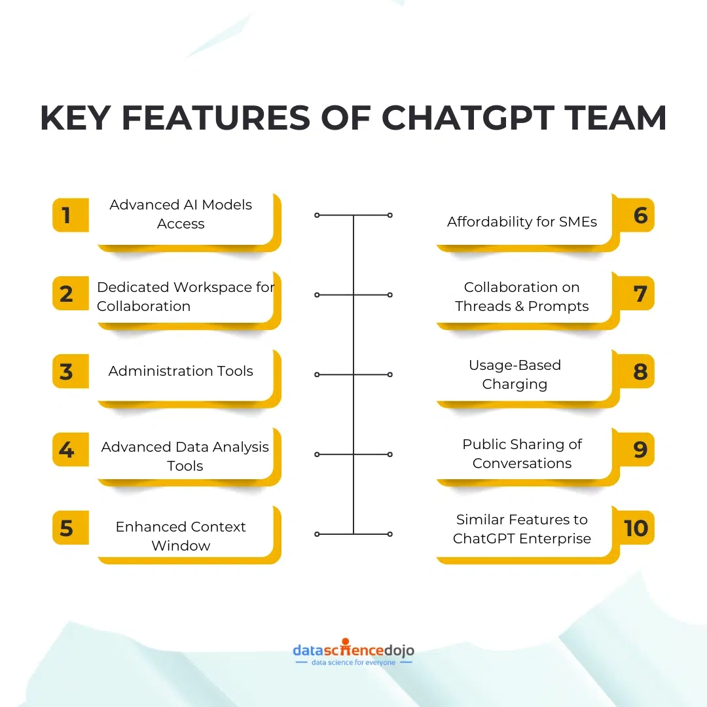

# 小企业为什么需要ChatGPT Team？这3个理由够实在

技术进步快得让人喘不过气，小企业主每天都在想：怎么才能不被甩在后面？OpenAI推出的ChatGPT Team可能就是你要找的那个工具。它不是什么高大上的概念产品，而是专门给中小企业设计的实用工具——能干活、省钱、还不复杂。

这篇文章会告诉你三个最实在的理由，为什么你的小企业应该考虑ChatGPT Team。不是那种"未来趋势"的空话，而是真实案例和具体数据。

---

## ChatGPT Team到底有什么？

OpenAI没把小企业当成企业版的"缩水客户"。ChatGPT Team包含的功能，说实话挺超值：

**你能用到的核心功能：**

- **最新的AI模型**：GPT-4和DALL·E 3都能用，不是阉割版
- **团队协作空间**：最多149人一起干活，共享对话和自定义GPT项目
- **数据分析工具**：处理大量数据，找出有用的规律
- **管理后台**：分配权限、追踪进度，管理起来不乱
- **32K上下文窗口**：AI能记住更长的对话内容，不会答非所问

**价格呢？** 如果按年付费，每人每月25美元。想想看，这相当于给每个员工配了个24小时在线的助手，这价格真不贵。

更重要的是，OpenAI承诺不会用你的业务数据来训练模型。对小企业来说，这个隐私保护很关键——你的客户信息、业务策略都不会被拿去"喂"AI。

哈佛商学院有个研究挺有意思：波士顿咨询公司的员工用了GPT-4之后，完成任务的速度快了25%，工作质量还提高了40%。这不是理论，是真实测出来的数据。

## 理由一：客服不用加班了

客服永远在线听起来很美好，但雇人三班倒？小企业根本烧不起这个钱。ChatGPT Team的AI聊天机器人可以24小时处理客户咨询，而且不会因为加班闹情绪。

**真实案例：** 一家零售公司用ChatGPT Team接管了常见问题——"这个有货吗？""什么时候发货？""怎么退货？"结果客户等待时间减少了40%，满意度大幅提升。

👉 想让你的团队效率翻倍？[ChatGPT Team会员能帮你实现全天候智能客服](https://shaoyumi.com/buy/65)，让每个咨询都能秒回。

**这能给你带来什么：**

- 客户提问几秒钟就有回复
- 人工客服可以专注处理真正复杂的问题
- 不用为了"全天候服务"多雇几个人

对小企业来说，这意味着你可以用有限的人手提供大公司才有的服务水平。客户满意了，你的成本还降了。

## 理由二：内容创作不再头疼

在互联网时代，不产出内容就等于隐身。但写博客、发社交媒体、想创意……这些事既费时间又耗脑细胞。ChatGPT Team可以帮你生成内容创意、起草文章、甚至建议SEO关键词。

**真实案例：** 一家精品营销机构用ChatGPT Team给客户生成内容创意和博客草稿。不仅创作速度快了，内容质量也提升了，客户的互动率明显变好。

**这能给你带来什么：**

- 内容创作速度提升，不用盯着空白屏幕发呆
- AI会建议热门话题和创意角度
- SEO优化建议帮你的内容更容易被搜到

注意，AI生成的是初稿和创意。最后的审核和调整还是得人来做——但起码你不用从零开始了。

## 理由三：重复劳动交给AI

小企业人手本来就紧张，结果大量时间花在数据录入、日程安排、整理客户反馈这些机械劳动上。ChatGPT Team可以自动化这些任务，让你的团队专注于真正创造价值的工作。

**真实案例：** 一家小型电商用ChatGPT Team分析客户反馈和市场趋势，根据AI给出的洞察调整了产品和营销策略。六个月后，销售额增长了30%。

**这能给你带来什么：**

- 机械的重复任务自动完成
- 数据分析给你可操作的建议，不是一堆看不懂的数字
- 决策更有依据，不是拍脑袋

对小企业来说，最宝贵的就是时间和精力。把这些资源从琐事中解放出来，投入到战略思考和业务拓展上，才是正道。

---

## 别光想，试试就知道了

ChatGPT Team不是什么高科技玩具，而是能解决实际问题的工具。客服效率、内容产出、数据分析——这些都是小企业每天要面对的硬仗。

市场竞争这么激烈，靠人力死磕已经不现实了。AI工具不是替代人，而是让你的团队战斗力翻倍。👉 想体验这种效率提升？[这里有ChatGPT Team会员特价账号](https://shaoyumi.com/buy/65)，每人每月25美元，给团队配个不下班的AI助手。

说白了，技术进步是挡不住的。早点用上趁手的工具,你的小企业才能在大公司的夹缝里活得更好。
